# 🧩 .NET Microservices Simulation — Auth, User, and Logger Services

## 📖 Overview

This project simulates a **microservices-based architecture** using **.NET 8**, focusing on **scalability**, **security**, and **observability**.  
It demonstrates **asynchronous communication**, **distributed caching**, and **structured logging** between three core services:

- **AuthService** — Authentication, authorization, and JWT management
- **UserService** — User registration, login, and profile operations
- **LoggerService** — Centralized logging and audit tracking

All services communicate via **RabbitMQ** and share a **Redis** cache for tokens and session state.

---

## ⚙️ Tech Stack


### 🧱 Core Technologies

| Category | Technology |
|----------|-----------|
| **Runtime** | .NET 8 |
| **Language** | C# 12 |
| **Frameworks** | ASP.NET Core Web API, Minimal API, Worker Services |
| **Containerization** | Docker, Docker Compose |
| **Communication** | HTTP, RabbitMQ (Message Queue) |
| **Caching** | Redis (StackExchange.Redis) |
| **Authentication** | JWT (RSA 4096-bit, asymmetric) |
| **Logging** | Serilog (Structured Logging, Console, File, MongoDB Sink) |
| **Configuration** | appsettings.json + environment overrides |
| **Validation** | FluentValidation |
| **Middleware** | Custom Logging, Request Tracking, Correlation ID |

### 🔐 AuthService Stack

| Function | Library |
|----------|---------|
| JWT Auth | Microsoft.AspNetCore.Authentication.JwtBearer |
| Token Caching | StackExchange.Redis |
| Messaging | RabbitMQ.Client |
| Logging | Serilog, Serilog.Sinks.Console |
| Security | System.Security.Cryptography (RSA 4096-bit) |

### 👤 UserService Stack

| Function | Library |
|----------|---------|
| API Calls | HttpClient, Newtonsoft.Json |
| Messaging | RabbitMQ.Client |
| Caching | StackExchange.Redis |
| Logging | Serilog, Serilog.Sinks.File |
| Validation | FluentValidation |

### 📜 LoggerService Stack

| Function | Library |
|----------|---------|
| Messaging | RabbitMQ.Client |
| Logging | Serilog, Serilog.Sinks.MongoDB (optional) |
| Background Workers | Microsoft.Extensions.Hosting |
| Serialization | Newtonsoft.Json |

---

## 🧠 High-Level Architecture

```mermaid
flowchart LR

subgraph Browser[Browser / Client]
    A1[POST /api/user/register]
    A2[POST /api/auth/login]
end

subgraph AuthService[AuthService 🔐]
    B1[Validate Credentials]
    B2[Generate JWT]
    B3[Save Token in Redis]
    B4[Publish Event: auth.token.generated]
    B5[Publish Event: auth.activity]
end

subgraph UserService[UserService 👤]
    C1[Register User]
    C2[Login User]
    C3[Consume auth.token.generated]
    C4[Check Redis for Token]
    C5[Publish Event: user.activity]
end

subgraph LoggerService[LoggerService 📜]
    D1[Consume Logs]
    D2[Store Structured Logs]
end

A1 --> C1 --> C5 --> D1
A2 --> B1 --> B2 --> B3 --> B4 --> C3 --> C4 --> C5 --> D1
B5 --> D1
```



---

## 🔄 Detailed Service Communication Flow

### 🧩 [AuthService]
Handles authentication, roles, and token generation.

```
[Browser] ---> POST /api/auth/login
    Middleware Order:
        - EnhancedLoggingMiddleware
        - ApiValidationMiddleware
        - Authentication & Authorization
        
    AuthService.LoginAsync():
        -> Validate credentials
        -> Generate JWT (RSA 4096-bit)
        -> Save token to Redis
        -> Publish events:
            * auth.token.generated (to UserService)
            * auth.activity (to LoggerService)
```

### 👤 [UserService]
Handles registration, login, and retrieves policies or roles from AuthService.

```
[Browser] ---> POST /api/user/register
    -> UserService.RegisterUserAsync():
        - Validate model
        - Create user record
        - Publish user.activity -> LoggerService

[UserService] ---> Receives (auth.token.generated)
    -> Check Redis for token validity
    -> Update session state
    -> Publish user.activity -> LoggerService
```

### 📜 [LoggerService]
Centralized logging and auditing service.

```
[LoggerService] ---> Consumes:
    - auth.activity
    - user.activity

    -> Parse event payload
    -> Log to structured store:
        * ApplicationLogs
        * UserActivityLogs
        * SecurityAuditLogs
```

---

## 🧰 Development Phases & TODO

### Phase 1 — Core Setup
- [x] Initialize solution and projects (AuthService, UserService, LoggerService)
- [x] Add Shared library for DTOs, events, and enums
- [x] Setup Docker for Redis and RabbitMQ
- [x] Add configuration templates

### Phase 2 — AuthService
- [x] Setup JWT signing with RSA key pair generation
- [x] Implement Redis-based token storage
- [x] Add Role & Policy management endpoints
- [x] Publish RabbitMQ events: auth.activity, auth.token.generated

### Phase 3 — UserService
- [x] Add registration and login endpoints
- [x] Consume RabbitMQ events from AuthService
- [x] Validate tokens from Redis
- [x] Publish RabbitMQ events: user.activity

### Phase 4 — LoggerService
- [x] Create RabbitMQ consumer worker
- [x] Implement structured log writer
- [x] Separate logs by category (Application, Activity, Security)

### Phase 5 — Cross-Service Enhancements
- [ ] Add correlation IDs for distributed tracing
- [ ] Implement retry logic and resilience patterns
- [ ] Add rate limiting & IP-based throttling
- [ ] Integrate Prometheus/Grafana for observability (optional)

---

## 🧪 Running the Project

### Prerequisites
- .NET 8 SDK
- Docker + Docker Compose
- Redis + RabbitMQ containers

### Setup Commands

```bash
# Run dependencies
docker-compose up -d

# Build services
dotnet build

# Run each service
dotnet run --project ./AuthService
dotnet run --project ./UserService
dotnet run --project ./LoggerService
```

### Health Checks

```bash
curl http://localhost:5000/api/auth/health
curl http://localhost:5001/api/user/health
curl http://localhost:5002/api/logger/health
```

---

## 🗂️ Folder Structure

```
/MicroserviceSimulation
│
├── AuthService/
│   ├── Controllers/
│   ├── Services/
│   ├── Messaging/
│   ├── Policies/
│   └── Program.cs
│
├── UserService/
│   ├── Controllers/
│   ├── Messaging/
│   ├── Cache/
│   └── Program.cs
│
├── LoggerService/
│   ├── Consumers/
│   ├── Logging/
│   └── Program.cs
│
├── Shared/
│   ├── DTOs/
│   ├── Events/
│   ├── Enums/
│
├── docker-compose.yml
└── README.md
```

---

## 🔒 Security Highlights

- ✅ RSA 4096-bit asymmetric JWT signing
- ✅ Centralized token validation via Redis
- ✅ Masked structured logs for sensitive fields
- ✅ Correlation ID for traceability
- ✅ Rate limiting middleware
- ✅ Optional RabbitMQ message signing

---

## 🚀 Future Enhancements

- [ ] Integrate OpenTelemetry for distributed tracing
- [ ] Add gRPC for internal service calls
- [ ] Implement Saga Pattern for transaction consistency
- [ ] Deploy via Kubernetes + Helm
- [ ] Add API Gateway (Ocelot) for centralized routing

---

## 👤 Author

This architecture serves as a realistic .NET microservice simulation for learning secure, scalable, and maintainable distributed systems.

---

## 📄 License

This project is open-source and available under the MIT License.